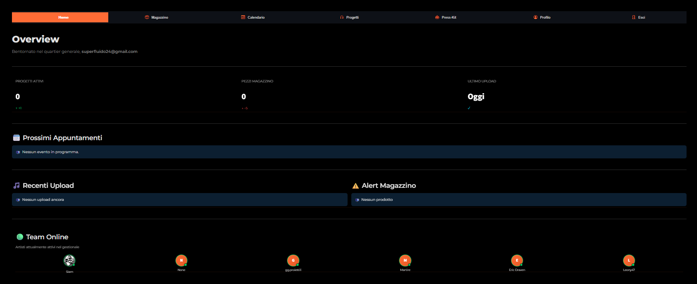
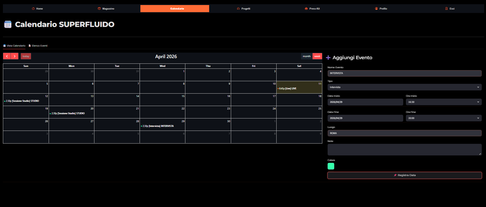
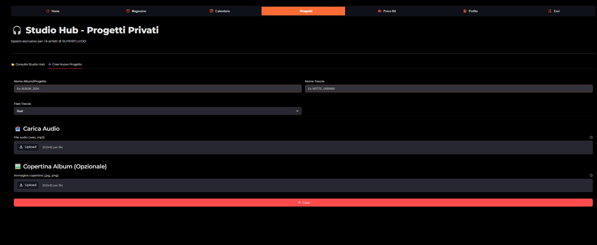
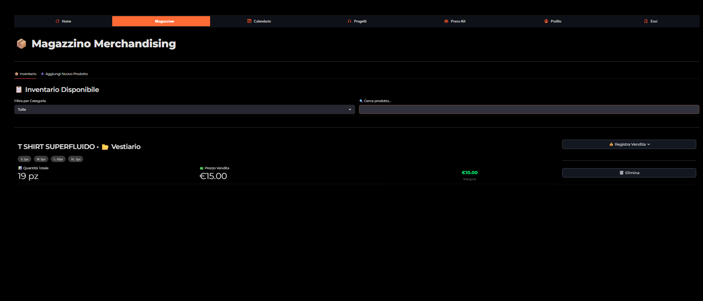
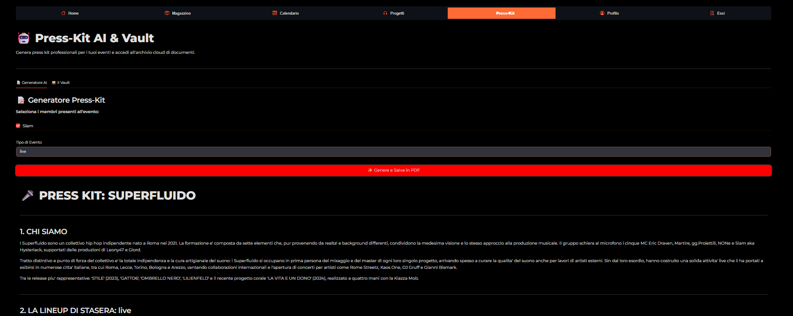

# 🎧 SUPERFLUIDO Bunker - Music Label ERP & Management Hub

SUPERFLUIDO Bunker è un gestionale web-based (ERP) full-stack progettato su misura per le esigenze di un collettivo musicale/etichetta indipendente. Centralizza la gestione del magazzino, l'organizzazione degli eventi live, l'archiviazione di progetti audio e la generazione automatizzata di Press Kit.

---

## 📖 The Story: Concept & Value Proposition

La gestione di un collettivo musicale oggi soffre di una frammentazione cronica: Google Drive per i file, WhatsApp per la comunicazione, Excel per il magazzino e diverse piattaforme esterne (spesso costose o limitate) per l'ascolto dei provini.

**SUPERFLUIDO Bunker nasce per centralizzare l'intera operatività in un unico Hub privato.** A differenza di soluzioni "low-cost" o preconfezionate, questo tool permette:
* **Workflow Unificato:** Sostituisce 4 o 5 applicazioni diverse, eliminando la dispersione dei dati.
* **Cloud Audio Professionale:** Uno "Studio Hub" privato senza limiti di spazio (basato su Supabase Storage) dove le tracce sono organizzate per fasi reali di produzione (*Beat, Provini, Mix, Master*).
* **Automazione Documentale:** Un agente AI che processa i dati degli artisti per generare istantaneamente Press Kit e Rider professionali.

---

## 🧠 Engineering & Backend Architecture

Sviluppare il "Bunker" ha significato progettare un'infrastruttura capace di gestire dati complessi e file binari pesanti in totale sicurezza.

### 1. Database Engineering & Real-Time CRUD
Il cuore del progetto è l'integrazione con **Supabase (PostgreSQL)**. Non abbiamo solo "collegato" un database, abbiamo architettato un sistema di tabelle relazionali che permette un'operatività fluida direttamente dall'app:
* **Operazioni Sincrone:** L'app gestisce flussi di *Crea-Sposta-Elimina* in tempo reale. Ogni azione sull'interfaccia si riflette istantaneamente sul DB cloud, garantendo l'integrità dei dati tra tutti i membri del collettivo.
* **Data Persistence:** Grazie alla logica implementata nel backend Python, abbiamo eliminato la necessità di tool esterni di gestione: il Bunker agisce come interfaccia amministrativa professionale per l'intero database.

### 2. Agente AI & Flussi Intelligenti
Non abbiamo integrato una semplice chat, ma un **Agente funzionale** che opera sui dati:
* **Dynamic PDF Engine:** L'agente recupera le biografie, le lineup e le specifiche tecniche (hospitality/tech rider) degli artisti dal database e, tramite il motore `FPDF2`, genera documenti pronti per il booking in frazioni di secondo.
* **Analisi Logistica:** Calcolo automatico dei margini di profitto nel magazzino e alert intelligenti che monitorano lo stato dello stock, automatizzando processi che normalmente richiederebbero ore di data-entry manuale.

### 3. Timezone Management & Data Integrity
Per risolvere i problemi di sincronizzazione tra server Cloud (UTC) e operatività locale (Europe/Rome), è stato implementato un sistema di gestione delle Timezone tramite `zoneinfo`. Questo garantisce che ogni evento a calendario e ogni timestamp di modifica dei progetti sia matematicamente esatto, evitando conflitti di pianificazione.

### 4. Custom UI & System Branding
Sebbene costruito su Streamlit, il Bunker è stato "hackerato" tramite CSS Injection massiccio per rimuovere il feeling da dashboard scientifica e trasformarlo in una Web App dal look Dark/Premium. Abbiamo disabilitato comportamenti nativi (zoom immagini, header standard) per proteggere la User Experience e mantenere un branding coerente con l'identità del collettivo.

---

## ✨ Core Features Detail

* **🎧 Studio Hub:** Gestione cloud completa per progetti audio con metadatazione per fase di sviluppo.
* **🤖 Press-Kit Agent:** Motore di generazione documenti basato sui profili artisti sincronizzati.
* **🗓️ Calendario Operativo:** Sistema di pianificazione eventi con doppia vista (Griglia/Lista) e gestione automatizzata dei fusi orari.
* **📦 Merch ERP:** Modulo di inventario professionale con gestione varianti e tracciamento vendite/margini.

---

## 🛠️ Tech Stack Completo

* **Frontend:** Python 3, Streamlit (Custom CSS)
* **Backend:** Supabase (PostgreSQL, Auth, Storage)
* **Logic & Data:** Pandas, Plotly, ZoneInfo
* **Document Automation:** FPDF2, UUID

---

## 📸 Sneak Peek

<div align="center">
  
  &nbsp;
  
</div>
<br>
<div align="center">
  
  &nbsp;
  
  &nbsp;
  
</div>

---

## 🏗️ Architettura di Sistema

```mermaid
graph TD
    Client[Browser Web / Mobile] -->|HTTPS| Frontend(Streamlit Frontend - Python)
    
    subgraph Streamlit Cloud Environment
        Frontend
        PDFGen[Generatore PDF - FPDF2]
        DataViz[Dashboard DataViz - Plotly]
    end

    Frontend <-->|Supabase Python Client| BaaS[Supabase Backend]

    subgraph Supabase Cloud
        BaaS --> Auth[Autenticazione & Ruoli]
        BaaS --> DB[(PostgreSQL Database)]
        BaaS --> Storage[Storage Buckets]
    end

    DB -->|Tabelle Relazionali| Features
    Storage -->|Audio .wav/.mp3 & Immagini| Features

    subgraph Moduli Core
        Features --> C[🗓️ Calendario Condiviso]
        Features --> M[📦 Magazzino & Varianti]
        Features --> S[🎧 Studio Hub / Audio Player]
        Features --> V[🗃️ Vault Documenti]
    end
